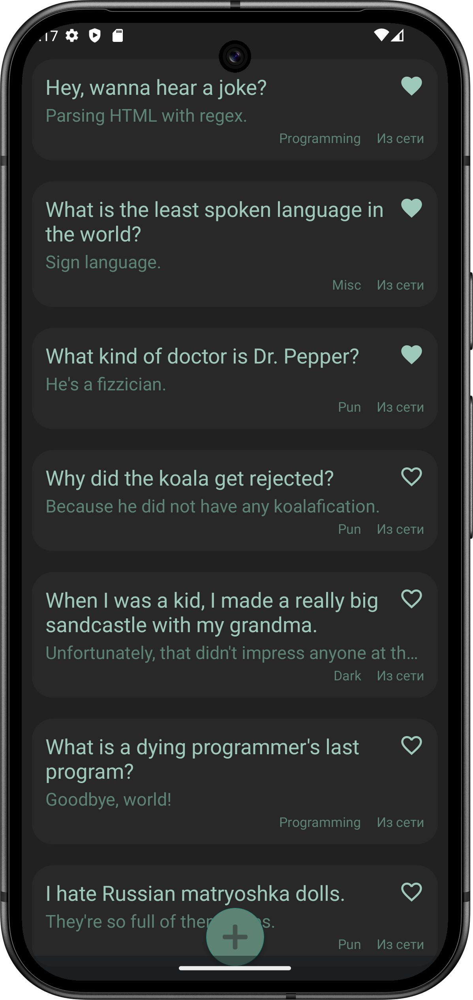
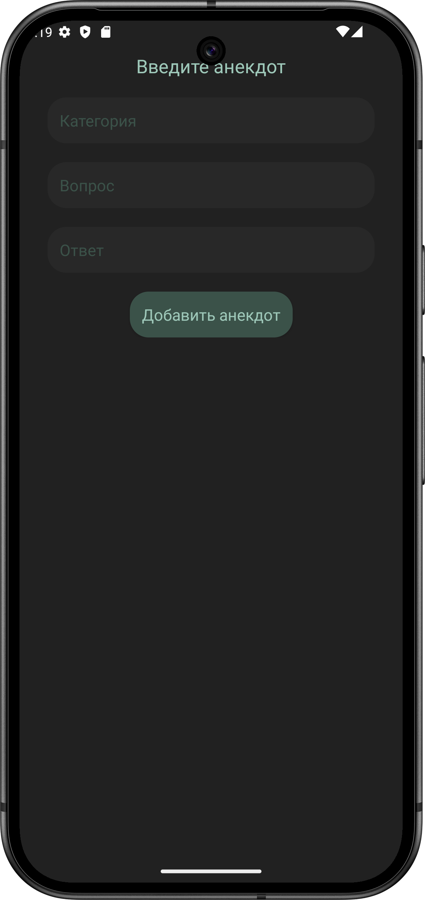
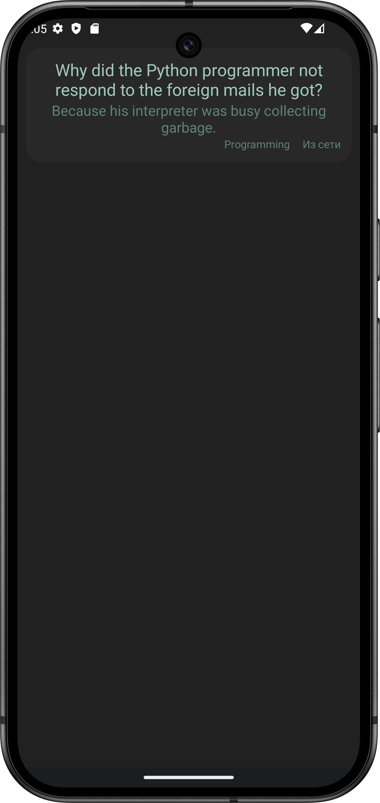

# JokeApp

**JokeApp** - это Android-приложение для просмотра анекдотов. Оно позволяет загружать анекдоты из сети, кэшировать их локально, добавлять собственные анекдоты и помечать понравившиеся как избранные.

## Функционал приложения

- **Загрузка анекдотов**: Приложение реализует пагинацию и загружает анекдоты  из сети.
- **Локальное добавление анекдотов**: Пользователи могут добавлять свои собственные анекдоты, которые сохраняются в отдельной сущности базы данных.
- **Кэширование**: Последние 10 загруженных анекдотов сохраняются в локальной базе данных. Если нет доступа к интернету, они будут восстановлены из кэша.
- **Избранное**: Любую шутку можно пометить как избранную. Избранные анекдоты хранятся вместе с локальными.
- **Подробный просмотр**: Каждый анекдот можно развернуть в отдельном фрагменте для удобного чтения.
- **Тестирование**: View-модели покрыты unit-тестами.

## Технологический стек

- **Язык программирования**: Kotlin
- **База данных**: Room (локальная БД)
- **Сетевой клиент**: Retrofit2
- **DI**: Dagger2
- **Архитектура**: MVVM
- **Coroutines**: Для асинхронных операций
- **StateFlow, SharedFlow**: Для обработки изменений данных

## Архитектура проекта

Проект составлен согласно принципам чистой архитектуры:

- **Data Layer**: Отвечает за работу с сетевым ресурсом и локальной БД.
- **Domain Layer**: Содержит логику приложения.
- **Presentation Layer**: Отвечает за работу с представлениями, содержит несколько фрагментов и соответствующие ViewModel'и.
- Отдельно реализован пакет ```di```, содержащий dagger-модули

## Скриншоты

<table>
  <tr>
    <td style="width:33%"></td>
    <td style="width:33%"></td>
    <td style="width:33%"></td>
  </tr>
</table>

## Тестирование

В этом проекте реализовано тестирование ключевых компонентов для обеспечения их надежности и корректности работы.

### Unit-тесты View-моделей

View-модели приложения полностью покрыты unit-тестами. Тесты проверяют следующие аспекты:

- Корректность загрузки данных из удаленного репозитория.
- Логику загрузки данных из локального репозитория при различных сценариях.
- Реакцию на пользовательские действия (добавление новой шутки, добавление в избранное).

Тесты написаны с использованием фреймворка **JUnit** и библиотеки **Mockito**. Для тестирования корутин используется соответствующий диспетчер.
